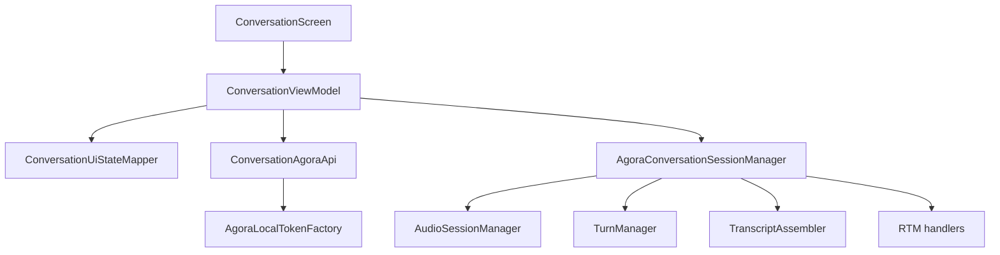
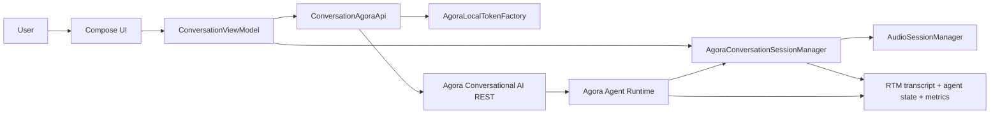
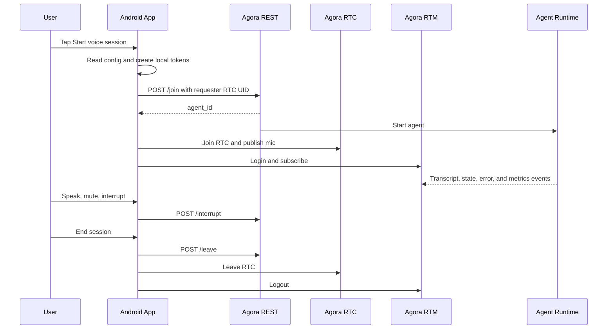
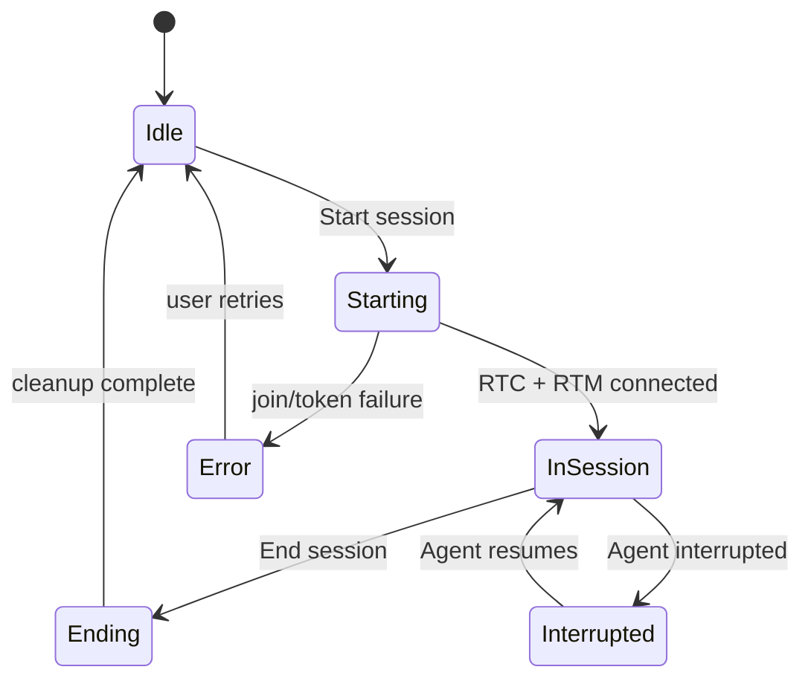
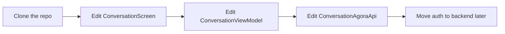

# Architecture

## Why This Template Is Useful

This repository is meant to help you move fast without having to invent the Agora wiring from scratch.

It shows how to:

- set up a realtime voice app in Android
- coordinate RTC, RTM, and agent REST calls
- display transcript and agent state in Compose
- keep the app structure understandable for future contributors
- use Agora as the realtime backbone for a voice AI experience

## Repo Structure

### Android Client

- `app/src/main/java/com/androidengineers/agent_quickstart_android/MainActivity.kt`: app entry point and microphone permission handling
- `app/src/main/java/com/androidengineers/agent_quickstart_android/ui/ConversationScreen.kt`: Compose UI for the pre-session and active-session states
- `app/src/main/java/com/androidengineers/agent_quickstart_android/ui/ConversationViewModel.kt`: screen state and user actions
- `app/src/main/java/com/androidengineers/agent_quickstart_android/ui/ConversationUiStateMapper.kt`: pure mapping from session data to UI state
- `app/src/main/java/com/androidengineers/agent_quickstart_android/rtc/AgoraConversationSessionManager.kt`: RTC, RTM, transcript, and audio session lifecycle
- `app/src/main/java/com/androidengineers/agent_quickstart_android/data/ConversationAgoraApi.kt`: direct Agora REST client
- `app/src/main/java/com/androidengineers/agent_quickstart_android/data/AgoraLocalTokenFactory.kt`: demo-only local token generation
- `app/src/main/java/com/androidengineers/agent_quickstart_android/config/QuickstartConfig.kt`: configuration helpers
- `app/src/main/java/com/androidengineers/agent_quickstart_android/model/ConversationModels.kt`: shared data models

### Voice Logic

- `app/src/main/java/com/androidengineers/agent_quickstart_android/audio/AudioSessionManager.kt`
- `app/src/main/java/com/androidengineers/agent_quickstart_android/audio/TurnManager.kt`
- `app/src/main/java/com/androidengineers/agent_quickstart_android/audio/SelfSpeechFilter.kt`
- `app/src/main/java/com/androidengineers/agent_quickstart_android/audio/BargeInDetector.kt`
- `app/src/main/java/com/androidengineers/agent_quickstart_android/rtc/TranscriptAssembler.kt`

### Tests

- `app/src/test/java/com/androidengineers/agent_quickstart_android/data/ConversationAgoraApiTest.kt`
- `app/src/test/java/com/androidengineers/agent_quickstart_android/data/AgoraLocalTokenFactoryTest.kt`
- `app/src/test/java/com/androidengineers/agent_quickstart_android/TranscriptAssemblerTest.kt`
- `app/src/test/java/com/androidengineers/agent_quickstart_android/audio/TurnManagerTest.kt`
- `app/src/test/java/com/androidengineers/agent_quickstart_android/audio/SelfSpeechFilterTest.kt`
- `app/src/test/java/com/androidengineers/agent_quickstart_android/ui/ConversationUiStateMapperTest.kt`

## Code Map

This is the easiest way to understand where the code lives:

- the screen renders state
- the ViewModel coordinates actions
- the session manager owns realtime behavior
- the API talks to Agora REST
- the audio helpers handle the voice edge cases

## How It Works

1. The app reads `AGORA_APP_ID`, `AGORA_APP_CERTIFICATE`, and related config from `local.properties`.
2. It generates RTC, RTM, and agent REST tokens locally for demo convenience.
3. It calls Agora REST to start the Conversational AI agent and scopes the agent to the generated requester RTC UID.
4. The Android app joins the RTC channel with the chorus audio scenario and subscribes to RTM.
5. The agent sends transcripts, state updates, errors, and metrics back to the app.
6. The user can speak, mute, interrupt, and end the session from the UI.

## Architecture At A Glance

The app keeps the template simple by using one Android client, one direct Agora REST client, and one session manager that owns the realtime media lifecycle.

## Session Lifecycle

## Session States

## Suggested Learning Path

If you are new to Agora, this is the best order:

1. See the UI first.
2. Learn how the ViewModel wires actions.
3. Inspect how the session manager handles RTC, RTM, and audio.
4. Read the API layer that starts and stops the agent.
5. Replace demo-only pieces once the end-to-end flow is clear.

## What To Edit First

If you are building a product around a voice assistant, this gives you a practical starting point for:

- support assistants
- call-center copilots
- interactive voice demos
- realtime conversational agents
- internal voice workflows and prototypes
